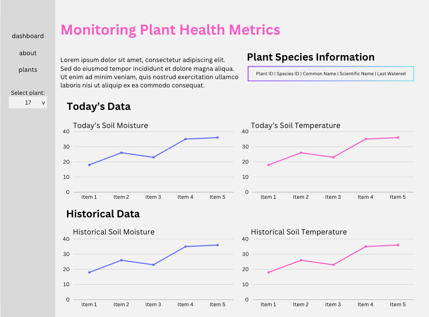

# Streamlit Dashboard for Plant Health Monitoring

This dashboard is designed to provide real-time visualisations of the data collected from the Liverpool Natural History Museum's conservatory plant sensors. The sensors capture various environmental factors, such as soil moisture, temperature, and humidity, which are then processed and visualised on this dashboard.

The dashboard will allow stakeholders to:

- Monitor short-term data (last 24 hours) stored in the RDS instance.
- Access long-term archived data stored in an S3 bucket.
- View graphs and insights on the health of individual plants, helping the museum's gardening team take prompt action when required.

The dashboard is built using Streamlit, which enables interactive and responsive visualisations for users to track plant health trends and spot any potential issues early.

## Dashboard wireframe



## Installation and Setup Instructions

### 1. **Repository Structure**
The application files are structured as follows:

- `dashboard.py`: The main Streamlit application file that contains the logic to visualise data.
- `sl_queries.py`: Contains SQL queries and functions for fetching recent data from the RDS instance.
- `requirements.txt`: Lists all the Python dependencies required to run the dashboard.

### 2. **Environment Variables**
Ensure that the following environment variables are defined in your `.env` file:

```
DB_HOST=<Your RDS host>
DB_PORT=<Your RDS port>
DB_NAME=<Your database name>
DB_USER=<Your database user>
DB_PASSWORD=<Your database password>
AWS_ACCESS_KEY=<Your AWS access key>
AWS_SECRET_ACCESS_KEY=<Your AWS secret key>
```

### 3. **Installing Dependencies**
After cloning the repository, set up a virtual environment:
```
python -m venv .venv
source .venv/bin/activate  # For Linux/MacOS
.venv\Scripts\activate     # For Windows
```
And install the required dependencies:<br>

`pip install -r requirements.txt`

### 4. **Running the application**
Once the environment is set up, you can run the Streamlit dashboard using:<br>

`streamlit run dashboard.py`

This will start the application, and a URL will be provided in the terminal (usually http://localhost:8501/), where the dashboard can be accessed.

### 5. **Customisation**

You can adjust the dashboard for specific needs by modifying:

- The queries in `sl_queries.py` for fetching different metrics.
- The visualisations in `dashboard.py` to accommodate additional plant metrics or changes to the layout.
