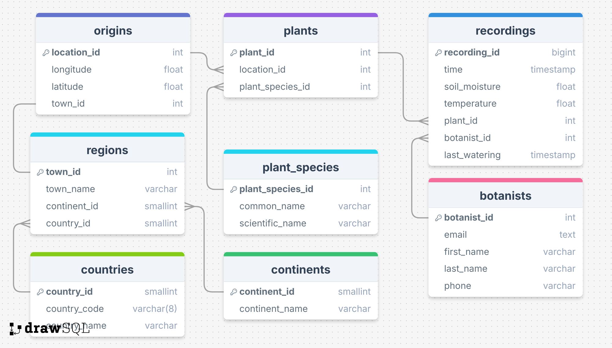

# LMNH pipeline database
This folder contains bash scripts that can be used to create tables and seed data into a SQL server RDS instance. 

## Setup
#### 1. Provision a microsoft SQL server RDS instance.

#### 2. Connect to this RDS instance, create a database called `plants` and within that a schema called `gamma` using the following commands:
```bash
sqlcmd -S {DB_HOST},{DB_PORT} -U {DB_USERNAME} -P {DB_PASSWORD} -Q 'CREATE DATABASE plants;'
sqlcmd -S {DB_HOST,{DB_PORT} -U {DB_USERNAME} -P {DB_PASSWORD} -d plants -Q 'CREATE SCHEMA gamma;'
```
#### 3. Create a .env file with the following variables:
    - HOST - RDS host endpoint
    - DB_PORT - RDS access port (typically 1433 for SQL server)
    - DB_NAME - For this project we will be working in the plants database
    - DB_PW - Password used to access RDS
    - DB_USER - Username used to access RDS 

#### 4. Create a venv and install requirements
```bash
python -m venv venv
source venv/bin/activate
pip install -r requirements.txt
```

## Usage
#### __1.__ In order to populate the database with Tables and seed those tables with data use the following command:
```bash
bash reset_database.sh
```
This script uses the schema described in `schema.sql` and shown below in figure 1 to create a normalised database for our plant data.  
Secondly, this command can be reused to reset the database to this state whenever necessary.


__Figure 1__: ERD for LMNH botanical database  


#### __2.__ To truncate the recordings table use the following command:
```bash
bash truncate_recordings.sh
```
This will remove any rows stored in the recordings table  


#### __3.__ Use connect.sh to quickly connect your database
```bash
bash connect.sh
```

## How it works
### schema.sql
- Uses SQL server dialect
- Drops tables if they exist already
- Creates tables in `plants` database and in `gamma` schema
### seed_data.sql
- Uses SQL server dialect
- Inserts static data into `regions`, `origins`, `countries`, `botanists` and `continents` table
### seed_plant_data.py
- Uses requests library to request data from the plants endpoint
- Processes the data using builtin python libraries
- Uses pyodbc to :
    - Connect to RDS to extract `plant_id` and `location_id`
    - Insert formatted data into `plants` table in `plants` database
### reset_database.sh
- Connects to RDS database using environment variables
- Runs schema.sql and seed_data.sql
- Runs seed_plant_data.py
### connect.sh
- Connects to RDS database using environment variables
### truncate_recordings.sh
- Connects to RDS database using environment variables
- Truncates the recordings table
### recordings.sh
- Connects to RDS database using environment variables
- Returns the number of rows in the recordings table